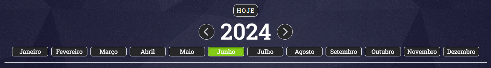
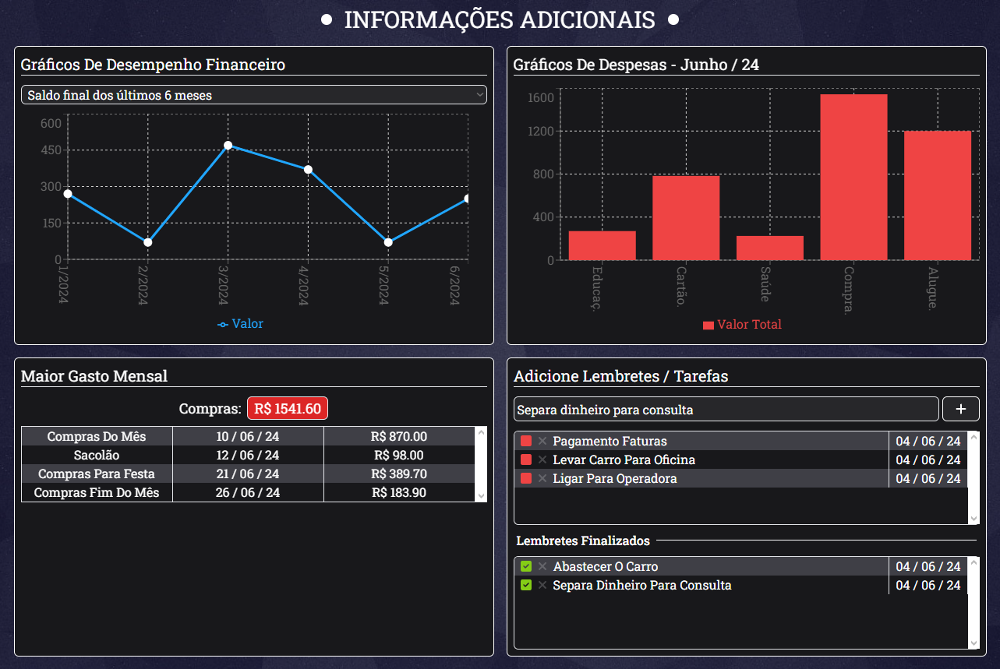
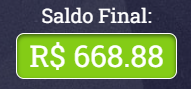
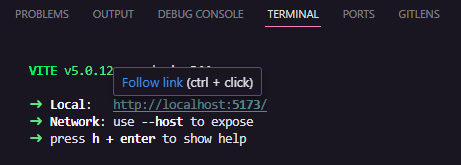

# Finantial Lighthouse

🧾✍ This is a personal project using React | TypeScript | Redux | Tailwind CSS

[Click here to view the project in your web browser](https://calculadora-de-gastos-gules.vercel.app).


## Summary

- [General Vision](#general-vision)
  - [Objective](#objective)
  - [Screenshots](#screenshots)
- [My Process](#my-process)
  - [Technologies Used](#technologies-used)
  - [Project Functionality](#project-functionality)
  - [How to Run the Project](#how-to-run-the-project)
  - [Continuous Development](#continuous-development)
  - [Useful Resources](#useful-resources)
- [Author](#author)

## General Vision

### Objective

- To create a website that permit the user analyse clearly his personal financies
- To add "income" or "expense" data to the tables and to visualize the final income
- Be able to delete these data, if necessary.
- To filter data by date throught timeline.
- Sections with extra informations:
  - Last six month data: A chart with the last six month income, expense or total income.
  - Monthly expense chart
  - Biggest monthly expense
  - Sticky notes to help the user to conclude requests and commitments.
- Footer with my personal contact.

### Screenshots

#### Functionality


#### Responsivity


## My Process

### Technologies Used

- [React](https://react.dev) - The cornerstone of my development toolkit, empowering me to craft reusable components that form the foundation of robust applications and stunning web interfaces.
- [Tailwind CSS](https://tailwindcss.com) - A highly configurable utility-first CSS framework that enables the rapid creation of modern, responsive user interfaces by applying classes directly in HTML, facilitating agile and consistent development.
- [Redux](https://redux.js.org) - A predictable state container for JavaScript apps that simplifies state management, making it easier to maintain and debug the state of complex applications through a centralized store and a strict unidirectional data flow.
- [LocalStorage](https://developer.mozilla.org/en-US/docs/Web/API/Window/localStorage) - Leveraged to persist the user's preferred page style selection, even after browser sessions are closed.
- [Typescript](https://www.typescriptlang.org) - A JavaScript superset that enhances code quality, minimizes bugs, and boosts security.
- [Font-awesome-icons](https://fontawesome.com) - A straightforward React library for easily integrating a wide range of icons into projects.

### Project Functionality

The main objective for this project is to make easier to visualize our personal financies. That way the project consist to use a formulary to add new data to the finantial tables. The formulary is organize using [React-Hook-Form](https://react-hook-form.com), to receive the data from form and to use them into the tables and on the additional data.

In the form, the user can set:
- origin: income or expense data
- category: as salary, shopping, health, etc
- date: it's possible to add data to current date, past and future date
- description: to help us to remember exactly what that data came from
- value: the cost of the income or expense data
- period: optional - to add as recurrent data (as salary, for example, that usualy is the same montlhy)

When the form is submitted, the react-hook-form runs the function onSubmit. It is responsible to add the data to the current month and to the next months, if the data was added as a recurrent data, and add it to the store at Redux.

```tsx
    const onSubmit: SubmitHandler<INewData> = (formData) => {
        const period = Number(formData.period);
        if (period > 1 && changePeriod) {
            const newArray = Array.from({ length: period }, (_, index) => {
                const month = formData.month + index;
                const adjustedMonth = month > 12 ? month - 12 : month;
                const adjustedYear = month > 12 ? formData.year + 1 : formData.year

                return {
                    ...formData,
                    month: adjustedMonth,
                    year: adjustedYear,
                }
            })
            newArray.map(data =>
                dispatch(addNewData(data))
            )
        } else {
            dispatch(addNewData(formData))
        }
    }
```
The data is added to the Redux store from the hook `useDispatch`, that executes custom functions. In this project, it was used the functions `addNewData`, that receives as parameter the data in `INewData` format, that is the data interface, and `removeTableData`, that receives the id of the data that must be deleted.

#### TablesData store's interface
```ts
export interface INewData {
    id: number,
    category: string,
    day: number,
    month: number,
    year: number,
    description: string,
    value: string,
    valueOrigin: string,
    period: number
}
```

Besides this store, it is used a store to aims the current Date selected from the user. It is used a timeline to help the user to add his data to the current date, besides past and future dates.

```ts
export interface ICurrentMonth {
    number: number,
    month: string
}
export interface ICurrentDate {
    currentMonth: ICurrentMonth,
    currentYear: number
}

const date = new Date();
const year = date.getFullYear();
const currentDate: ICurrentDate = {
    currentMonth: {
        number: data.months[date.getMonth()].id,
        month: data.months[date.getMonth()].name,
    },
    currentYear: year,
}
```

Thought this state, we can acess the month and the year selected by the user and the month as number (03) or string ("March").

Using these stores, and receiving the data from form, we use these informations into some custom hooks:

### 1. useDataFilteredByDate

Here the data is filtered by the current date setted in the timeline by the user. That way, the data rendered on the screen will be ever be the data from the month and year selected by him.

**Timeline section**


This hook returns the data sorted by the days of the month.

```ts
    const sortedData = filteredData.sort((a, b) => a.day - b.day);
    return sortedData;
```

### 2. useBiggestMontlhyExpense

This hook returns the data expense category that has the biggest cost, the list of datas of this category in the specific month/year selected by the user and the total cost.

```ts
interface IBiggestMonthlyExpense {
    category: string;
    totalValue: number;
    data: INewData[];
}
```

### 3. useLastSixMonthData

The `useLastSixMonthData` hook returns the total balance, the total expense or the difference from these values from the last six months as an array of numbers.

```ts
export interface MonthlyData {
    [key: string]: number | null;
}

interface LastSixMonthData {
    incomeTotal: MonthlyData;
    expenseTotal: MonthlyData;
    differencePerMonth: MonthlyData;
}
```

### 4. useMontlhyExpenseByCategory

Here is simple, the `useMonthlyExpensesByCategory` hook filters the data by date and then groups and calculates the monthly expenses by category, returning an array of objects that contains the category, the total value of expenses, and the list of expenses for that category.

```ts
interface ICategoryExpense {
    category: string;
    totalValue: number;
    expenses: INewData[];
}
```

All these hooks are used to created the additional informations' section, that is render to the user on this way:



Just the stickyNotes section that is used a simple Redux store to store the sticky notes created by the user. Then, the user can mark the task as completed or delete it.

In short, that is the functionality of the project. The data returned by these custom hooks, the rest of the project is created. Finnaly, the elements of the project were style using [Tailwind CSS](https://tailwindcss.com) to organize and turn the stylization faster and smooth.

Some examples of use of the Tailwind:

```tsx
<div className="flex flex-col items-center gap-1">
    <h3 className="text-center break-all text-lg capitalize md:text-xl">
    Saldo final:
    </h3>
    <p className={`text-center capitalize break-all font-normal text-2xl border px-3 py-1 rounded-lg border-white text-white shadow-inner duration-500 ${finalBalanceBgColor()} md:text-3xl`}
    >
        R$ {calculateFinalBalance()}
    </p>
</div>
```

Result:



That must be terrible at first seem, but that is easy and I'll sumarize:
- flex = display: flex;
- flex-col = flex-direction: collumn;
- items-center = align-items: center;
- gap-1 = gap: 0.25rem;
- text-center = text-align: center;
- capitalize = text-transform: capitalize;

The utility-classes from tailwind don't have the same syntax of the traditional css styles, but they are similar, as "flex" and "display: flex". For them that are used to CSS, in just litte time are capable to domain [Tailwind CSS](https://tailwindcss.com).

Last, but not least, the website has a lot of informations, that this may scare the user. Thinking on it, the React-Joyride library is used to create a simple tutorial on where and how to use the website functionalities.

It is simple to be used, we have to create a file that contains the paths that it should follow.

```ts
export const steps = [
    {
        target: "#hero",
        content: "Bem-vindo ao Farol Financeiro. Vamos começar a explorar!",
        disableBeacon: true,
    },
    {
        target: "#timeLine",
        content: "Use a linha do tempo para selecionar o mês ou ano desejado.",
        placement: "top",
        disableBeacon: true,
    },
    //The rest of the steps
]
```

- Target: Where the tutorial must focus on. Here we are using the id of a component, but it's also possible to use a class from an element, for example.
- Content: The message that will be show to the user, to explain to him what to do.
- diseableBeacon: It is an option in React-Joyride that allows controlling the display of the visual highlight (beacon) around the target element during a tour, disabling it if needed to provide a more customized or straightforward user experience.

There are a lot of other options to be used. Then, we can configure it using a component:

```tsx
          <Joyride
            steps={steps as Step[]}
            run={run}
            continuous
            showSkipButton
            hideCloseButton
            callback={handleTourCallback}
            styles={{
              options: {
                zIndex: 10000,
              },
            }}
          />
```

All of these props can be found the explanation on the docummentation [here](https://docs.react-joyride.com/props). But, in summarize, we are guiding it here it must be render, what must be used and to change the styles of the balloon of react-joyride. The final result is that:


**globalStyle.tsx** - smooth scroll

```tsx
export const GlobalStyle = createGlobalStyle`
// ...
    html {
        scroll-behavior: smooth;
    }
`
```

### How to execute the project
- The project was created with [React-Vite](https://vitejs.dev).

- To download the project, open the terminal in the VSCode and write the dependencies code installations: **npm install**

The package.json file already contains the version of the library in its data, so all the libraries used in this project will be installed on your machine in the same way. But if you are interested in how to download, use, or learn more about the libraries that were used in my code, as well as the localStorage, access the links in the [Usefull resources](#usefull-resources).

- To run the project in the browser, it is necessary to activate **NPM Scripts** in the three dots next to the EXPOLORER of VSCode or to write on the terminal `npm run dev`.


- Then, in the bottom-left window of **NPM SCRIPTS**, click on the **run** button next to package.json/dev vite.


- Finally, in the terminal, keep the **localhost** link will appear where the project will be running in your browser. Hover over it and click **Follow link**, or press the ctrl button on your keyboard and click on the **localhost**, and the page will open in your default browser.



There are other ways to open the project, but that form it is the one that I'm used to use.

### Continuous development

The main focus on this project is to improve my knowledge using Redux and Tailwind CSS. I decided to learn these two technologies at the same time, so the development of it took me more time then I expect, but I also learn much more than I thoght. 

Redux is a brilliant technology, but it's not necessary when the project is simple, because the Contect API can lead of it easily. But when the project is complex and huge, it is better.

Tailwind CSS at the beggining took me a lot of time, because it is necessary to read the doccumentation every minute when we decide to use a new CSS property. But, after to use the same class-utility many times, we can remember easily what to use. After a while, even when we need to use a CSS property as a class-utility for the first time, we can suppose how to write it, because we can get used to the form how the creator think when he created the Tailwind.

A plugin that helps me a lot was [Tailwind CSS IntelliSense](https://marketplace.visualstudio.com/items?itemName=bradlc.vscode-tailwindcss) that gives some hints to help us when we are writing our utility classes. I huge recommend it to them who are starting now their learning journey with Tailwind.

### Useful Resources

- [Tailwind CSS](https://tailwindcss.com) - A highly configurable utility-first CSS framework that enables the rapid creation of modern, responsive user interfaces by applying classes directly in HTML, facilitating agile and consistent development.

- [Redux](https://redux.js.org) - A predictable state container for JavaScript apps that simplifies state management, making it easier to maintain and debug the state of complex applications through a centralized store and a strict unidirectional data flow.

- [LocalStorage](https://developer.mozilla.org/en-US/docs/Web/API/Window/localStorage): The localStorage read-only property of the window interface allows you to access a Storage object for the Document's origin; the stored data is saved across browser sessions.

- [TypeScript](https://www.typescriptlang.org): TypeScript enhances JavaScript development with static typing, improved tooling, and better code readability, leading to more robust and maintainable applications.

- [React-Joyride](https://docs.react-joyride.com) - A feature-rich library for creating guided tours and walkthroughs in React applications, offering customizable steps with tooltips and beacons to visually highlight elements, enhancing user onboarding and feature discovery.

## Author

- GitHub - [Felipe Santiago Morais](https://github.com/SantiagoMorais)
- Linkedin - [Felipe Santiago](https://www.linkedin.com/in/felipe-santiago-873025288/)
- Instagram - [@felipe.santiago.morais](https://www.instagram.com/felipe.santiago.morais)
- Email - <a href="mailto:contatofelipesantiago@gmail.com" target="blank">contatofelipesantiago@gmail.com</a>


